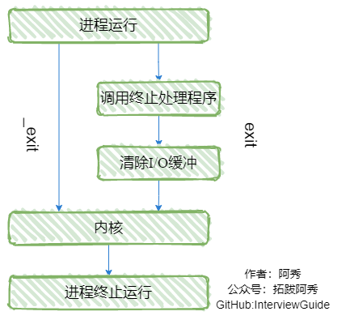

<h1 align="center">操作系统</h1>


<p  id="进程线程和协程的区别和联系"></p>

<div style="border-color: #24C6DC;
            background-color: #e9f9f3;         
            margin: 1rem 0;
        padding: .25rem 1rem;
        border-left-width: .3rem;
        border-left-style: solid;
        border-radius: .5rem;
        color: inherit;">
  <p>这是六则或许对你有些许帮助的信息:</p>
<p>⭐️1、阿秀与朋友合作开发了一个<span style="font-weight:bold;color:red">编程资源网站</span>，目前已经收录了很多不错的学习资源和黑科技（附带下载地址），如过你想要寻求合适的编程资源，<a href="https://tools.interviewguide.cn/home" style="text-decoration: underline" target="_blank">欢迎体验</a>以及推荐自己认为不错的资源，众人拾柴火焰高，我为人人，人人为我🔥！</p>  <p>2、👉23年5月份阿秀从<a style="text-decoration: underline" href="https://mp.weixin.qq.com/s?__biz=Mzk0ODU4MzEzMw==&mid=2247512170&idx=1&sn=c4a04a383d2dfdece676b75f17224e78" target="_blank">字节跳动离职跳槽到某外企</a>期间，为<span style="font-weight:bold">方便自己找工作，增加上岸几率</span>，我自己从0开发了一个<span style="font-weight:bold;color:red">互联网中大厂面试真题解析网站</span>，包括两个前端和一个后端。能够定向查看某些公司的某些岗位面试真题，比如我想查一下行业为互联网，公司为字节跳动，考察岗位为后端，考察时间为最近一年之类的面试题有哪些？
<div align="center">
</div>网站地址：<a style="text-decoration: underline" href="https://top.interviewguide.cn/" target="_blank">InterviewGuide大厂面试真题解析网站</a>。点此可以查看该网站的视频介绍：<a style="text-decoration: underline" href="https://www.bilibili.com/video/BV1f94y1C7BL" target="_blank">B站视频讲解</a>   如果可以的话求个B站三连，感谢！
    </p>3、😊
    分享一个阿秀自己私藏的<span style="font-weight:bold;color:red">黑科技网站</span>，<a style="text-decoration: underline" href="https://hkjtz.cn/" target="_blank">点此直达</a>，主要是各类小众实用APP、网站等，除此外也包括高清影视、音乐、电视剧、AI、纪录片、英语四六级考试、考研考公、副业等资源。
  </p>
  <p>4、😍免费分享阿秀个人学习计算机以来收集到的免费学习资源，<a style="text-decoration: underline" href="/notes/07-resources/01-free/01-introduce.html" target="_blank">点此白嫖</a>；也记录一下自己以前买过的<a style="text-decoration: underline" href="/notes/07-resources/02-precious.html" target="_blank">不错的计算机书籍、网络专栏和垃圾付费专栏</a>；也记录一下自己以前买过的<a style="text-decoration: underline" href="/notes/07-resources/02-precious.html" target="_blank">不错的计算机书籍、网络专栏和垃圾付费专栏</a>
  </p>
  <p>5、🚀如果你想在校招中顺利拿到更好的offer，阿秀建议你多看看前人<a style="text-decoration: underline" href="https://www.yuque.com/tuobaaxiu/httmmc/npg1k81zeq4wfpyz" target="_blank">踩过的坑</a>和<a style="text-decoration: underline"  target="_blank" href="https://www.yuque.com/tuobaaxiu/httmmc/gge9ppd0mbu2d3dp">留下的经验</a>，事实上你现在遇到的大多数问题你的学长学姐师兄师姐基本都已经遇到过了。
  </p>
  <p>6、🔥 欢迎准备计算机校招的小伙伴加入我的<a  style="text-decoration: underline" href="https://www.yuque.com/tuobaaxiu/httmmc/xg0otqvc17wfx4u9" target="_blank">学习圈子</a>，一个人踽踽独行不如一群人报团取暖，圈子里沉淀了很多过去21/22/23/24/25届学长学姐的<a  style="text-decoration: underline" href="https://www.yuque.com/tuobaaxiu/httmmc/gge9ppd0mbu2d3dp" target="_blank">经验和总结</a>，好好跟着走下去的，最后基本都可以拿到不错的offer！</a>如果你需要《阿秀的学习笔记》网站中📚︎校招八股文相关知识点的PDF版本的话，可以<a style="text-decoration: underline" href="https://www.yuque.com/tuobaaxiu/httmmc/qs0yn66apvkzw0ps" target="_blank">点此下载</a> 。</p>   </div>
>


## 21、说一下你理解中的内存？他有什么作用呢？


<P  id="操作系统经典问题之哲学家进餐问题"></p>


## 22、操作系统经典问题之哲学家进餐问题


五个哲学家围着一张圆桌，每个哲学家面前放着食物。哲学家的生活有两种交替活动：吃饭以及思考。当一个哲学家吃饭时，需要先拿起自己左右两边的两根筷子，并且一次只能拿起一根筷子。

下面是一种错误的解法，如果所有哲学家同时拿起左手边的筷子，那么所有哲学家都在等待其它哲学家吃完并释放自己手中的筷子，导致死锁。

```c
#define N 5

void philosopher(int i) {
    while(TRUE) {
        think();
        take(i);       // 拿起左边的筷子
        take((i+1)%N); // 拿起右边的筷子
        eat();
        put(i);
        put((i+1)%N);
    }
}
```

为了防止死锁的发生，可以设置两个条件：

- 必须同时拿起左右两根筷子；
- 只有在两个邻居都没有进餐的情况下才允许进餐。

```c
#define N 5
#define LEFT (i + N - 1) % N // 左邻居
#define RIGHT (i + 1) % N    // 右邻居
#define THINKING 0
#define HUNGRY   1
#define EATING   2
typedef int semaphore;
int state[N];                // 跟踪每个哲学家的状态
semaphore mutex = 1;         // 临界区的互斥，临界区是 state 数组，对其修改需要互斥
semaphore s[N];              // 每个哲学家一个信号量

void philosopher(int i) {
    while(TRUE) {
        think(i);
        take_two(i);
        eat(i);
        put_two(i);
    }
}

void take_two(int i) {
    down(&mutex);
    state[i] = HUNGRY;
    check(i);
    up(&mutex);
    down(&s[i]); // 只有收到通知之后才可以开始吃，否则会一直等下去
}

void put_two(i) {
    down(&mutex);
    state[i] = THINKING;
    check(LEFT); // 尝试通知左右邻居，自己吃完了，你们可以开始吃了
    check(RIGHT);
    up(&mutex);
}

void eat(int i) {
    down(&mutex);
    state[i] = EATING;
    up(&mutex);
}

// 检查两个邻居是否都没有用餐，如果是的话，就 up(&s[i])，使得 down(&s[i]) 能够得到通知并继续执行
void check(i) {         
    if(state[i] == HUNGRY && state[LEFT] != EATING && state[RIGHT] !=EATING) {
        state[i] = EATING;
        up(&s[i]);
    }
}
```

<p  id="操作系统经典问题之读者写者问题"></p>


## 23、操作系统经典问题之读者-写者问题

允许多个进程同时对数据进行读操作，但是不允许读和写以及写和写操作同时发生。

一个整型变量 count 记录在对数据进行读操作的进程数量，一个互斥量 count_mutex 用于对 count 加锁，一个互斥量 data_mutex 用于对读写的数据加锁。

```c
typedef int semaphore;
semaphore count_mutex = 1;
semaphore data_mutex = 1;
int count = 0;

void reader() {
    while(TRUE) {
        down(&count_mutex);
        count++;
        if(count == 1) down(&data_mutex); // 第一个读者需要对数据进行加锁，防止写进程访问
        up(&count_mutex);
        read();
        down(&count_mutex);
        count--;
        if(count == 0) up(&data_mutex);//最后一个读者要对数据进行解锁，防止写进程无法访问
        up(&count_mutex);
    }
}

void writer() {
    while(TRUE) {
        down(&data_mutex);
        write();
        up(&data_mutex);
    }
}
```

<p  id="介绍一下几种典型的锁"></p>


## 24、介绍一下几种典型的锁？

### 读写锁

- 多个读者可以同时进行读
- 写者必须互斥（只允许一个写者写，也不能读者写者同时进行）
- 写者优先于读者（一旦有写者，则后续读者必须等待，唤醒时优先考虑写者）

### 互斥锁

一次只能一个线程拥有互斥锁，其他线程只有等待

互斥锁是在抢锁失败的情况下主动放弃CPU进入睡眠状态直到锁的状态改变时再唤醒，而操作系统负责线程调度，为了实现锁的状态发生改变时唤醒阻塞的线程或者进程，需要把锁交给操作系统管理，所以互斥锁在加锁操作时涉及上下文的切换。

互斥锁实际的效率还是可以让人接受的，加锁的时间大概100ns左右，而实际上互斥锁的一种可能的实现是先自旋一段时间，当自旋的时间超过阀值之后再将线程投入睡眠中，因此在并发运算中使用互斥锁（每次占用锁的时间很短）的效果可能不亚于使用自旋锁

### 条件变量

互斥锁一个明显的缺点是他只有两种状态：锁定和非锁定。而条件变量通过允许线程阻塞和等待另一个线程发送信号的方法弥补了互斥锁的不足，他常和互斥锁一起使用，以免出现竞态条件。

当条件不满足时，线程往往解开相应的互斥锁并阻塞线程然后等待条件发生变化。一旦其他的某个线程改变了条件变量，他将通知相应的条件变量唤醒一个或多个正被此条件变量阻塞的线程。

总的来说**互斥锁是线程间互斥的机制，条件变量则是同步机制。**

### 自旋锁

如果进线程无法取得锁，进线程不会立刻放弃CPU时间片，而是一直循环尝试获取锁，直到获取为止。

如果别的线程长时期占有锁，那么自旋就是在浪费CPU做无用功，但是自旋锁一般应用于加锁时间很短的场景，这个时候效率比较高。

<p  id="你知道哪几种线程锁POSIX"></p>


## 24.1、你知道哪几种线程锁（POSIX）？

### **互斥锁（mutex）**

互斥锁属于sleep-waiting类型的锁。例如在一个双核的机器上有两个线程A和B，它们分别运行在core 0和core 1上。假设线程A想要通过pthread_mutex_lock操作去得到一个临界区的锁，而此时这个锁正被线程B所持有，那么线程A就会被阻塞，此时会通过上下文切换将线程A置于等待队列中，此时core 0就可以运行其他的任务（如线程C）。

### **条件变量(cond)**

### **自旋锁(spin)**

自旋锁属于busy-waiting类型的锁，如果线程A是使用pthread_spin_lock操作去请求锁，如果自旋锁已经被线程B所持有，那么线程A就会一直在core 0上进行忙等待并不停的进行锁请求，检查该自旋锁是否已经被线程B释放，直到得到这个锁为止。因为自旋锁不会引起调用者睡眠，所以自旋锁的效率远高于互斥锁。

虽然它的效率比互斥锁高，但是它也有些不足之处：

- 自旋锁一直占用CPU，在未获得锁的情况下，一直进行自旋，所以占用着CPU，如果不能在很短的时间内获得锁，无疑会使CPU效率降低。

- 在用自旋锁时有可能造成死锁，当递归调用时有可能造成死锁。

- 自旋锁只有在内核可抢占式或SMP的情况下才真正需要，在单CPU且不可抢占式的内核下，自旋锁的操作为空操作。自旋锁适用于锁使用者保持锁时间比较短的情况下。

<p id="逻辑地址为爱死物理地址"></p>


## 25、逻辑地址VS物理地址

编译时只需确定变量x存放的相对地址是100 ( 也就是说相对于进程在内存中的起始地址而言的地址)。

CPU想要找到x在内存中的实际存放位置，只需要用进程的起始地址+100即可。

相对地址又称逻辑地址，绝对地址又称物理地址。

<p  id="怎么回收线程有哪几种方法"></p>


## 26、怎么回收线程？有哪几种方法？

- **等待线程结束：** int pthread_join(pthread_t tid, void** retval);

  主线程调用，等待子线程退出并回收其资源，类似于进程中wait/waitpid回收僵尸进程，调用pthread_join的线程会被阻塞。

  - tid：创建线程时通过指针得到tid值。

  - retval：指向返回值的指针。

- **结束线程：** void pthread_exit(void *retval);

  子线程执行，用来结束当前线程并通过retval传递返回值，该返回值可通过pthread_join获得。

  - retval：同上。

- **分离线程：** int pthread_detach(pthread_t tid);

  主线程、子线程均可调用。主线程中pthread_detach(tid)，子线程中pthread_detach(pthread_self())，调用后和主线程分离，子线程结束时自己立即回收资源。

  - tid：同上。

<p  id="内存的覆盖是什么有什么特点"></p>


## 27、内存的覆盖是什么？有什么特点？

由于程序运行时并非任何时候都要访问程序及数据的各个部分（尤其是大程序），因此可以把用户空间分成为一个固定区和若干个覆盖区。

将经常活跃的部分放在固定区，其余部分按照调用关系分段，首先将那些即将要访问的段放入覆盖区，其他段放在外存中，在需要调用前，系统将其调入覆盖区，替换覆盖区中原有的段。

覆盖技术的特点：是打破了必须将一个进程的全部信息装入内存后才能运行的限制，但当同时运行程序的代码量大于主存时仍不能运行，再而，大家要注意到，内存中能够更新的地方只有覆盖区的段，不在覆盖区的段会常驻内存。

<p  id="内存交换是什么有什么特点"></p>


## 28、内存交换是什么？有什么特点？

**交换(对换)技术的设计思想**：内存空间紧张时，系统将内存中某些进程暂时换出外存，把外存中某些已具备运行条件的进程换入内存(进程在内存与磁盘间动态调度)

换入：把准备好竞争CPU运行的程序从辅存移到内存。

换出：把处于等待状态（或CPU调度原则下被剥夺运行权力）的程序从内存移到辅存，把内存空间腾出来。

<p  id="什么时候会进行内存的交换"></p>


## 29、什么时候会进行内存的交换？

内存交换通常在许多进程运行且内存吃紧时进行，而系统负荷降低就暂停。

例如:在发现许多进程运行时经常发生缺页，就说明内存紧张，此时可以换出一些进程;如果缺页率明显下降，就可以暂停换出。

<p  id="终端退出终端运行的进程会怎样"></p>


## 30、终端退出，终端运行的进程会怎样

终端在退出时会发送SIGHUP给对应的bash进程，bash进程收到这个信号后首先将它发给session下面的进程，

如果程序没有对SIGHUP信号做特殊处理，那么进程就会随着终端关闭而退出.

<p  id="如何让进程后台运行"></p>


## 31、如何让进程后台运行

（1）命令后面加上&即可，实际上，这样是将命令放入到一个作业队列中了

（2）ctrl + z 挂起进程，使用jobs查看序号，在使用bg %序号后台运行进程

（3）nohup + &，将标准输出和标准错误缺省会被重定向到 nohup.out 文件中，忽略所有挂断（SIGHUP）信号

（4）运行指令前面 + setsid，使其父进程编程init进程，不受HUP信号的影响

（5）将 命令+ &放在()括号中，也可以是进程不受HUP信号的影响

<p  id="什么是快表你知道多少关于快表的知识"></p>


## 32、什么是快表，你知道多少关于快表的知识？

快表，又称联想寄存器(TLB) ，是一种访问速度比内存快很多的高速缓冲存储器，用来存放当前访问的若干页表项，以加速地址变换的过程。与此对应，内存中的页表常称为慢表。


<p  id="地址变换中有快表和没快表有什么区别"></p>


## 33、地址变换中，有快表和没快表，有什么区别？

|                        | 地址变换过程                                                 | 访问一个逻辑地址的访存次数                      |
| ---------------------- | ------------------------------------------------------------ | ----------------------------------------------- |
| 基本地址变换机构       | ①算页号、页内偏移量 ②检查页号合法性 ③查页表，找到页面存放的内存块号 ④根据内存块号与页内偏移量得到物理地址 ⑤访问目标内存单元 | 两次访存                                        |
| 具有快表的地址变换机构 | ①算页号、页内偏移量 ②检查页号合法性 ③查快表。若命中，即可知道页面存放的内存块号，可直接进行⑤;若未命中则进行④ ④查页表，找到页面存放的内存块号，并且将页表项复制到快表中 ⑤根据内存块号与页内偏移量得到物理地址 ⑥访问目标内存单元 | 快表命中，只需一次访存 快表未命中，需要两次访存 |

<p  id="在执行malloc申请内存的时候操作系统是怎么做的"></p>


## 34、在执行malloc申请内存的时候，操作系统是怎么做的？

从操作系统层面上看，malloc是通过两个系统调用来实现的： brk和mmap

* brk是将进程数据段(.data)的最高地址指针向高处移动，这一步可以扩大进程在运行时的堆大小
* mmap是在进程的虚拟地址空间中寻找一块空闲的虚拟内存，这一步可以获得一块可以操作的堆内存。

通常，分配的内存小于128k时，使用brk调用来获得虚拟内存，大于128k时就使用mmap来获得虚拟内存。

进程先通过这两个系统调用获取或者扩大进程的虚拟内存，获得相应的虚拟地址，在访问这些虚拟地址的时候，通过缺页中断，让内核分配相应的物理内存，这样内存分配才算完成。

<p  id="守护进程僵尸进程和孤儿进程"></p>


## 35、 守护进程、僵尸进程和孤儿进程

### 守护进程

指在后台运行的，没有控制终端与之相连的进程。它独立于控制终端，周期性地执行某种任务。Linux的大多数服务器就是用守护进程的方式实现的，如web服务器进程http等

创建守护进程要点：

（1）让程序在后台执行。方法是调用fork（）产生一个子进程，然后使父进程退出。

（2）调用setsid（）创建一个新对话期。控制终端、登录会话和进程组通常是从父进程继承下来的，守护进程要摆脱它们，不受它们的影响，方法是调用setsid（）使进程成为一个会话组长。setsid（）调用成功后，进程成为新的会话组长和进程组长，并与原来的登录会话、进程组和控制终端脱离。

（3）禁止进程重新打开控制终端。经过以上步骤，进程已经成为一个无终端的会话组长，但是它可以重新申请打开一个终端。为了避免这种情况发生，可以通过使进程不再是会话组长来实现。再一次通过fork（）创建新的子进程，使调用fork的进程退出。

（4）关闭不再需要的文件描述符。子进程从父进程继承打开的文件描述符。如不关闭，将会浪费系统资源，造成进程所在的文件系统无法卸下以及引起无法预料的错误。首先获得最高文件描述符值，然后用一个循环程序，关闭0到最高文件描述符值的所有文件描述符。

（5）将当前目录更改为根目录。

（6）子进程从父进程继承的文件创建屏蔽字可能会拒绝某些许可权。为防止这一点，使用unmask（0）将屏蔽字清零。

（7）处理SIGCHLD信号。对于服务器进程，在请求到来时往往生成子进程处理请求。如果子进程等待父进程捕获状态，则子进程将成为僵尸进程（zombie），从而占用系统资源。如果父进程等待子进程结束，将增加父进程的负担，影响服务器进程的并发性能。在Linux下可以简单地将SIGCHLD信号的操作设为SIG_IGN。这样，子进程结束时不会产生僵尸进程。

### 孤儿进程

如果父进程先退出，子进程还没退出，那么子进程的父进程将变为init进程。（注：任何一个进程都必须有父进程）。

 一个父进程退出，而它的一个或多个子进程还在运行，那么那些子进程将成为孤儿进程。孤儿进程将被init进程(进程号为1)所收养，并由init进程对它们完成状态收集工作。 

### 僵尸进程

如果子进程先退出，父进程还没退出，那么子进程必须等到父进程捕获到了子进程的退出状态才真正结束，否则这个时候子进程就成为僵尸进程。

设置**僵尸进程的目**的是维护子进程的信息，以便父进程在以后某个时候获取。这些信息至少包括进程ID，进程的终止状态，以及该进程使用的CPU时间，所以当终止子进程的父进程调用wait或waitpid时就可以得到这些信息。如果一个进程终止，而该进程有子进程处于僵尸状态，那么它的所有僵尸子进程的父进程ID将被重置为1（init进程）。继承这些子进程的init进程将清理它们（也就是说init进程将wait它们，从而去除它们的僵尸状态）。

<p  id="如何避免僵尸进程"></p>


## 36、如何避免僵尸进程？

- 通过signal(SIGCHLD, SIG_IGN)通知内核对子进程的结束不关心，由内核回收。如果不想让父进程挂起，可以在父进程中加入一条语句：signal(SIGCHLD,SIG_IGN);表示父进程忽略SIGCHLD信号，该信号是子进程退出的时候向父进程发送的。

- 父进程调用wait/waitpid等函数等待子进程结束，如果尚无子进程退出wait会导致父进程阻塞。waitpid可以通过传递WNOHANG使父进程不阻塞立即返回。
- 如果父进程很忙可以用signal注册信号处理函数，在信号处理函数调用wait/waitpid等待子进程退出。
- 通过两次调用fork。父进程首先调用fork创建一个子进程然后waitpid等待子进程退出，子进程再fork一个孙进程后退出。这样子进程退出后会被父进程等待回收，而对于孙子进程其父进程已经退出所以孙进程成为一个孤儿进程，孤儿进程由init进程接管，孙进程结束后，init会等待回收。

第一种方法忽略SIGCHLD信号，这常用于并发服务器的性能的一个技巧因为并发服务器常常fork很多子进程，子进程终结之后需要服务器进程去wait清理资源。如果将此信号的处理方式设为忽略，可让内核把僵尸子进程转交给init进程去处理，省去了大量僵尸进程占用系统资源。

<p  id="局部性原理你知道吗主要有哪两大局部性原理各自是什么"></p>


##  37、局部性原理你知道吗？主要有哪两大局部性原理？各自是什么？

主要分为**时间局部性和空间局部性**。

时间局部性:如果执行了程序中的某条指令，那么不久后这条指令很有可能再次执行;如果某个数据被访问过，不久之后该数据很可能再次被访问。(因为程序中存在大量的循环)
空间局部性:一旦程序访问了某个存储单元，在不久之后，其附近的存储单元也很有可能被访问。(因为很多数据在内存中都是连续存放的，并且程序的指令也是顺序地在内存中存放的)


<p  id="父进程子进程进程组作业和会话"></p>


## 38、父进程、子进程、进程组、作业和会话

### 父进程

已创建一个或多个子进程的进程

### 子进程

由fork创建的新进程被称为子进程（child process）。该函数被调用一次，但返回两次。两次返回的区别是子进程的返回值是0，而父进程的返回值则是新进程（子进程）的进程 id。

将子进程id返回给父进程的理由是：因为一个进程的子进程可以多于一个，没有一个函数使一个进程可以获得其所有子进程的进程id。

对子进程来说，之所以fork返回0给它，是因为它随时可以调用getpid()来获取自己的pid；也可以调用getppid()来获取父进程的id。(进程id 0总是由交换进程使用，所以一个子进程的进程id不可能为0 )。

fork之后，操作系统会复制一个与父进程完全相同的子进程，虽说是父子关系，但是在操作系统看来，他们更像兄弟关系，这2个进程共享代码空间，但是数据空间是互相独立的，子进程数据空间中的内容是父进程的完整拷贝，指令指针也完全相同，子进程拥有父进程当前运行到的位置（两进程的程序计数器pc值相同，也就是说，子进程是从fork返回处开始执行的）。

但有一点不同，如果fork成功，子进程中fork的返回值是0，父进程中fork的返回值是子进程的进程号，如果fork不成功，父进程会返回错误。

子进程从父进程继承的有：

1.进程的资格(真实(real)/有效(effective)/已保存(saved)用户号(UIDs)和组号(GIDs))

2.环境(environment)

3.堆栈

4.内存

5.进程组号


独有：

1.进程号；

2.不同的父进程号(译者注：即子进程的父进程号与父进程的父进程号不同， 父进程号可由getppid函数得到)；

3.资源使用(resource utilizations)设定为0

### 进程组

进程组就是多个进程的集合，其中肯定有一个组长，其进程PID等于进程组的PGID。只要在某个进程组中一个进程存在，该进程组就存在，这与其组长进程是否终止无关。

### 作业

shell分前后台来控制的不是进程而是作业（job）或者进程组（Process Group）。

一个前台作业可以由多个进程组成，一个后台也可以由多个进程组成，shell可以运行一个前台作业和任意多个后台作业，这称为作业控制

### **为什么只能运行一个前台作业？** 

当我们在前台新起了一个作业，shell就被提到了后台，因此shell就没有办法再继续接受我们的指令并且解析运行了。 

但是如果前台进程退出了，shell就会有被提到前台来，就可以继续接受我们的命令并且解析运行。

作业与进程组的区别：如果作业中的某个进程有创建了子进程，则该子进程是不属于该作业的。 
一旦作业运行结束，shell就把自己提到前台（子进程还存在，但是子进程不属于作业），如果原来的前台进程还存在（这个子进程还没有终止），他将自动变为后台进程组

### 会话

会话（Session）是一个或多个进程组的集合。一个会话可以有一个控制终端。在xshell或者WinSCP中打开一个窗口就是新建一个会话。

<p  id="进程终止的几种方式"></p>


## 39、进程终止的几种方式

1、main函数的自然返回，`return` 
2、调用`exit`函数，属于c的函数库
3、调用`_exit`函数，属于系统调用
4、调用`abort`函数，异常程序终止，同时发送SIGABRT信号给调用进程。 
5、接受能导致进程终止的信号：ctrl+c (^C)、SIGINT(SIGINT中断进程) 

**exit和_exit的区别**




<p  id="里牛客死中异常和中断的区别"></p>


## 40、Linux中异常和中断的区别

### **中断**

大家都知道，当我们在敲击键盘的同时就会产生中断，当硬盘读写完数据之后也会产生中断，所以，我们需要知道，中断大多数是由硬件设备产生的，而它们从物理上说就是电信号。

之后，它们通过中断控制器发送给CPU，接着CPU判断收到的中断来自于哪个硬件设备（这定义在内核中）。

最后，由CPU发送给内核，有内核处理中断。下面这张图显示了中断处理的流程：


**软件中断与软中断**
除了硬件中断，还存在部分由软件产生的中断，称之为软件中断（Software Interrupt），最常见的有引发系统调用的Int 0x80。

同时，软件中断又区别于软中断（SoftIRQ），软中断主要用于中断处理的下半程（Bottom Halves），非关键逻辑的部分，来提高中断处理的效率与实时性，最常用于I/O相关的中断处理。

处理中断下半程的方法除了软中断，还有tasklet，二者存在一定的区别与联系：

* 二者都可以被注册用于中断处理下半程的延时任务；
* 同一种类型的tasklet只能串行执行，而同类型的软中断可以多个CPU并发执行，不同类型的软中断和tasklet均可并发执行；
* tasklet底层是基于两种软中断来实现的，分别是HI_SOFTIRQ和TASKLET_SOFTIRQ；

### **异常**

我们在学习《计算机组成原理》的时候会知道两个概念，CPU处理程序的时候一旦程序不在内存中，会产生缺页异常；当运行除法程序时，当除数为0时，又会产生除0异常。

所以，大家也需要记住的是，**异常是由CPU产生的，同时，它会发送给内核，要求内核处理这些异常**，下面这张图显示了异常处理的流程：


### **相同点**

- 最后都是由CPU发送给内核，由内核去处理

- 处理程序的流程设计上是相似的

### **不同点**

- 产生源不相同，异常是由CPU产生的，而中断主要是由硬件设备产生的
- 内核需要根据是异常还是中断调用不同的处理程序
- 中断不是时钟同步的，这意味着中断可能随时到来；异常由于是CPU产生的，所以它是时钟同步的
- 当处理中断时，处于中断上下文中；处理异常时，处于进程上下文中

<p  id="瘟都死和里牛客死环境下内存分布情况"></p>


